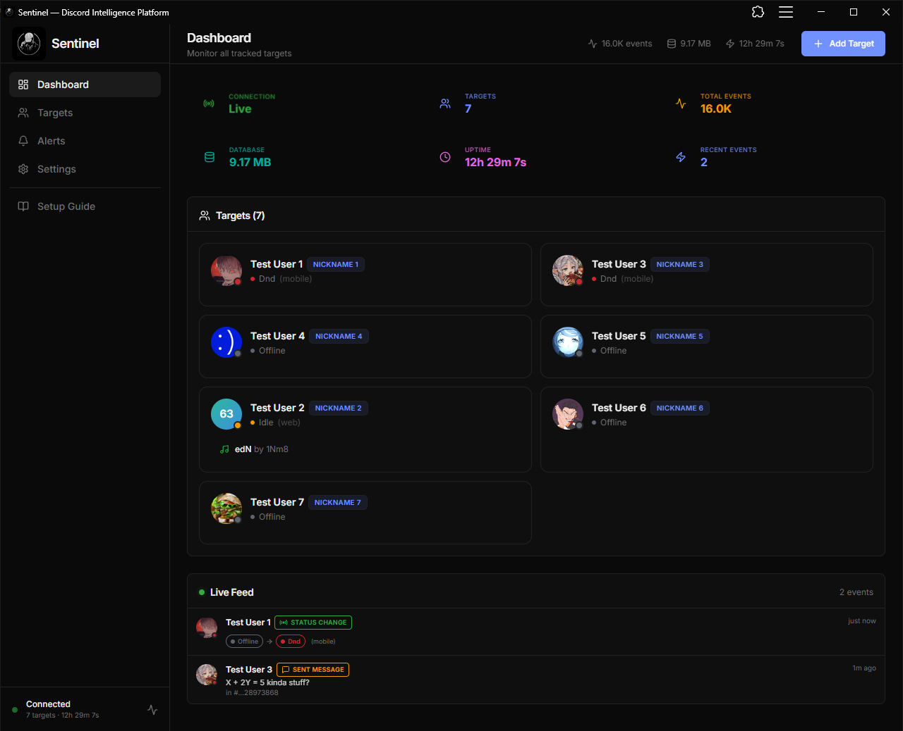
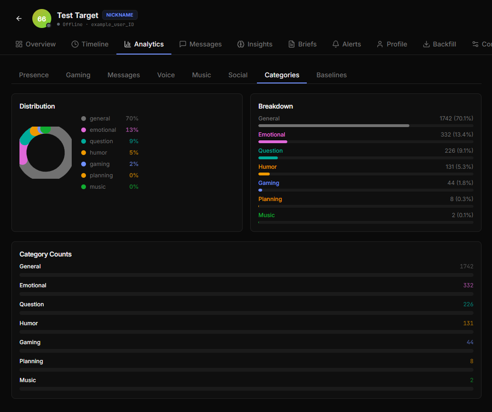
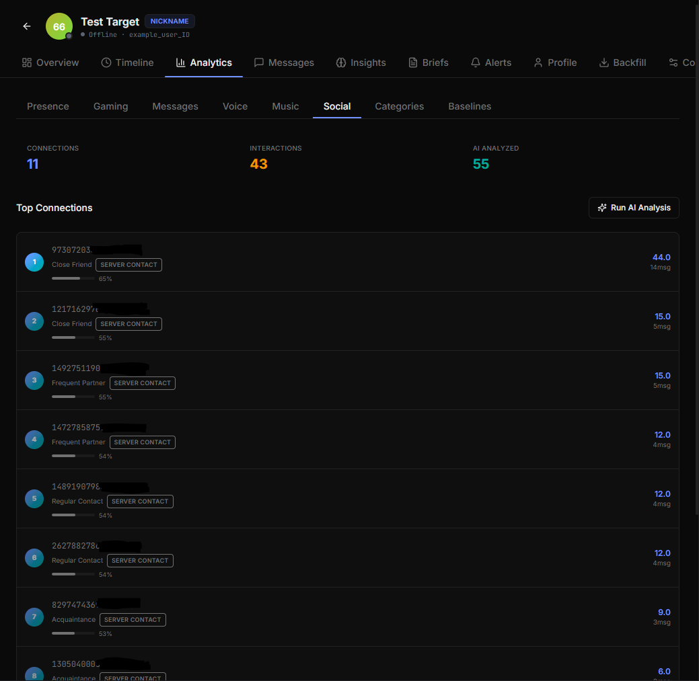

<p align="center">
  
</p>
<table align="center">
  <tr>
    <td>
      
    </td>
    <td>
      <h1>🧢 Sentinel</h1>
      <h3><em>Know everything. Miss nothing.</em></h3>
      <p>Real-time Discord intelligence with AI-powered analysis.</p>
    </td>
  </tr>
</table>

<p align="center">
  <a href="https://github.com/Privex-chat/sentinel"></a>
  <a href="https://github.com/Privex-chat/sentinel"></a>
  <br>
  <a href="https://polyformproject.org/licenses/noncommercial/1.0.0"></a>
  
  
</p>

---

## Why Sentinel?

Sentinel is a **self-hosted Discord intelligence system** that turns raw activity into meaningful insight. It watches everything — presence, messages, edits, deletions, voice, interactions — and then uses AI to **categorise, map, and surface what actually matters.**

> 🔍 **From "what happened?" to "what does it mean?"** — automatically.

---

## Core Capabilities

| Capability | What it does |
|---|---|
| 🟢 **Real-Time Presence Tracking** | Event-driven via Discord's gateway op 14 — status and platform changes delivered instantly, including offline, with no polling lag |
| 🧭 **Full Behavioural Tracking** | Presence, activities, messages, edits, deletions, voice, reactions, and interaction timelines |
| 🖥️ **Self-Command System** | Manage tracking directly from Discord — messages delete instantly, no trace remains in the channel |
| 🏷️ **AI Message Categorisation** | Instantly classifies messages into context-rich categories (gaming, music, venting, humor, etc.) |
| 🌐 **AI Social Graph Analysis** | Maps relationships with confidence scores — close friend, romantic interest, group buddy, and more |
| 📈 **Pattern & Behaviour Insights** | Detects trends, anomalies, sleep schedules, routine shifts, and availability windows |
| 🔔 **Instant Alerts** | Discord webhook alerts with digest mode, fatigue protection, and composite conditions |
| 📡 **Live Monitoring (REST + SSE)** | Stream events as they happen — Server-Sent Events for real-time UI updates |
| 🔒 **Local-First + Private** | SQLite by default, optional Supabase sync — nothing leaves your system unless you configure it |

---

## 🖼️ See It In Action

### 🖥️ Sentinel Dashboard

<p align="center">
  
</p>

Main Sentinel dashboard at [sentinel-panel.vercel.app](https://sentinel-panel.vercel.app) connected to a [sentinel-selfbot](https://github.com/Privex-chat/sentinel-selfbot) running on Railway 24/7.

### 🏷️ AI Message Categorisation

<p align="center">
  
</p>

Every message is automatically tagged — *Gaming*, *Humor*, *Question*, *Emotional*, etc. — giving instant context at scale.

### 🌐 Social Graph Visualisation

<p align="center">
  
</p>

Sentinel builds a dynamic relationship map from interaction patterns. Clusters, bridges, and relationship arcs emerge over time.

---

## Simple Example

> **Behavioural shift detected for `sonixaep`**
> Previously: 80% of messages in `#general`, mostly neutral.
> Today: 90% in `#memes`, sentiment shifted sharply negative.
> → **Alert pushed to your Discord webhook in real time.**

This isn't just logging — it's understanding that something **changed**, and telling you before you'd notice.

---

## 🖥️ Self-Command System

Type commands in any Discord channel. The command message is deleted **immediately** before anyone else sees it. The response self-deletes after a few seconds. No trace.

| Command | Description |
|---|---|
| `$add <@user>` | Add a tracking target |
| `$remove <@user>` | Remove a target |
| `$pause <@user>` | Suspend tracking, preserve history |
| `$resume <@user>` | Re-activate a paused target |
| `$label <@user> <text>` | Set a display label |
| `$note <@user> <text>` | Append a timestamped note |
| `$status <@user>` | Current presence, platform & activities |
| `$seen <@user>` | When the target was last online |
| `$uptime <@user>` | Today's active time with progress bar |
| `$streak <@user>` | Time in current status uninterrupted |
| `$history <@user> [n]` | Last N presence transitions |
| `$pattern <@user>` | 30-day hourly heatmap (`▁▂▃▄▅▆▇█`) |
| `$list` | All active targets with live status |
| `$ping` | REST & gateway latency |
| `$stats` | System stats — targets, events, DB size, uptime |
| `$reload` | Reload rules & config live (no restart) |
| `$help` | Full command reference |

→ Full reference: [docs/commands.md](docs/commands.md)

---

## The Ecosystem

| Component | Description | Status |
|---|---|---|
| [sentinel-selfbot](https://github.com/Privex-chat/sentinel-selfbot) | Core intelligence engine. Collects all data, runs AI, powers the system. Event-driven presence tracking via Discord gateway op 14. | ✅ Stable |
| [sentinel-plugin](https://github.com/Privex-chat/sentinel-plugin) | In-Discord dashboard via Vencord. Real-time insights without leaving Discord. | ✅ Stable |
| [sentinel-proxy](https://github.com/Privex-chat/sentinel-proxy) | Seamless remote access bridge for externally hosted setups (Windows). | ✅ Stable |
| [sentinel-web](https://github.com/Privex-chat/sentinel-web) | Full-featured browser dashboard. Monitor from anywhere. | ✅ Stable |
| [sentinel-bot](https://github.com/Privex-chat/sentinel-bot) | Multi-server intelligence network using a proper bot token. | 🔧 In Development |
<<<<<<< Updated upstream
| [sentinel-desktop](https://github.com/Privex-chat/sentinel-desktop) | Electron app bundling selfbot + web dashboard into a single Windows installer. | 🧪 Beta |
=======
| [sentinel-desktop](https://github.com/Privex-chat/sentinel-desktop) | Electron app bundling selfbot + web dashboard into a single Windows installer. | ✅ Stable |
>>>>>>> Stashed changes

---

## 🔧 How It Works

```
Discord Gateway (WebSocket)
       │
       │  PRESENCE_UPDATE, MESSAGE_CREATE, VOICE_STATE_UPDATE, ...
       ▼
sentinel-selfbot
       │
       ├── Op 14 subscriptions → instant offline detection, no polling lag
       ├── Collectors → SQLite database
       ├── Alert engine → webhook notifications
       ├── AI analysis → social graph, message categories, daily briefs
       └── Fastify HTTP API (:48923) + SSE stream
              │
    ┌─────────┼──────────────────┬──────────────┐
    ▼         ▼                  ▼              ▼
sentinel-  sentinel-proxy   sentinel-web   sentinel-desktop
 plugin   (Windows bridge)  (any browser)  (Electron app — bundles
                                            selfbot + web in one
                                            Windows installer)
```

1. **Collection** — Continuous event ingestion from Discord's gateway. Op 14 subscriptions push presence changes (including offline) in real time for tracked users.
2. **Processing** — AI categorises messages, maps relationships, generates briefs. Alert rules evaluate on every event.
3. **Storage** — Local SQLite. Optional Supabase mirror for cloud deployments.
4. **Interface** — Plugin + web dashboard consume the REST/SSE API.
5. **Alerts** — Webhook notifications fire instantly, or in digest batches.

---

## 🚀 Quick Start

```bash
git clone https://github.com/Privex-chat/sentinel-selfbot.git
cd sentinel-selfbot
npm install
cp .env.example .env
# Set DISCORD_TOKEN and API_AUTH_TOKEN at minimum
npm run build && npm start
```

Then connect the plugin or web panel to `http://localhost:48923`.

Add your first target in any Discord channel:
```
$add @username
```
The message deletes instantly. Tracking starts within 5 seconds.

---

## 🗺️ Deployment Options

| Scenario | What to use |
|---|---|
| Everything local | selfbot + plugin. No proxy needed. |
| Selfbot on VPS/Railway, plugin on local Discord | selfbot (remote) + proxy (local Windows) + plugin |
| Browser access from anywhere | selfbot (anywhere) + sentinel-web |
| **Windows one-click install** | **sentinel-desktop — bundles selfbot + dashboard, no terminal needed** |
| All interfaces | selfbot + proxy + plugin + web |

**Recommended for 24/7:** Deploy the selfbot on Railway, access data via the web panel at [sentinel-panel.vercel.app](https://sentinel-panel.vercel.app).

---

## 📚 Documentation

| Guide | Description |
|---|---|
| [docs/selfbot.md](docs/selfbot.md) | Full setup and configuration guide |
| [docs/commands.md](docs/commands.md) | Self-command system reference |
| [docs/api.md](docs/api.md) | REST & SSE API reference |
| [docs/presence-tracking.md](docs/presence-tracking.md) | How real-time presence tracking works (op 14 deep-dive) |
| [docs/architecture.md](docs/architecture.md) | System architecture and data flow |
| [docs/plugin.md](docs/plugin.md) | Plugin setup guide |
| [docs/web.md](docs/web.md) | Web dashboard guide |
| [docs/proxy.md](docs/proxy.md) | Proxy setup guide |
| [docs/supabase.md](docs/supabase.md) | Supabase cloud sync setup |

---

## ⚠️ Important Notes

- **Selfbot usage** — Running automated code on a regular Discord user account violates Discord's Terms of Service. Use a dedicated, separate account. Understand the risks.
- **Data stays local** — Nothing is sent to external servers unless you explicitly configure Supabase sync or webhook integrations.
- **Ethical boundary** — Only track people you have a legitimate reason to monitor. This tool is for personal use and research. Using it to stalk, harass, or harm anyone is entirely your responsibility.

---

## 📜 License

Licensing varies by component:

| Component | License |
|---|---|
| sentinel-selfbot | [PolyForm Noncommercial 1.0.0](https://polyformproject.org/licenses/noncommercial/1.0.0) — free for personal and non-commercial use |
| sentinel-plugin | [PolyForm Noncommercial 1.0.0](https://polyformproject.org/licenses/noncommercial/1.0.0) |
| sentinel-proxy | [PolyForm Noncommercial 1.0.0](https://polyformproject.org/licenses/noncommercial/1.0.0) |
| sentinel-web | [PolyForm Noncommercial 1.0.0](https://polyformproject.org/licenses/noncommercial/1.0.0) |
| sentinel-desktop | [PolyForm Noncommercial 1.0.0](https://polyformproject.org/licenses/noncommercial/1.0.0) |
| sentinel-bot | **Proprietary** — Source visible for transparency. No rights to use, copy, modify, distribute, or fork. See [sentinel-bot-LICENSE](sentinel-bot-LICENSE). |

Copyright © 2026–present Hemansh ([privexchat@gmail.com](mailto:privexchat@gmail.com))

---

## 📂 Repository Index

- [sentinel](https://github.com/Privex-chat/sentinel) — This repo. Umbrella docs and overview.
- [sentinel-selfbot](https://github.com/Privex-chat/sentinel-selfbot) — Data collection and AI engine.
- [sentinel-plugin](https://github.com/Privex-chat/sentinel-plugin) — Vencord plugin UI.
- [sentinel-proxy](https://github.com/Privex-chat/sentinel-proxy) — Windows local proxy.
- [sentinel-web](https://github.com/Privex-chat/sentinel-web) — Browser dashboard.
- [sentinel-bot](https://github.com/Privex-chat/sentinel-bot) — Community intelligence bot (in development, proprietary).
- [sentinel-desktop](https://github.com/Privex-chat/sentinel-desktop) — Electron desktop app (Windows installer).
